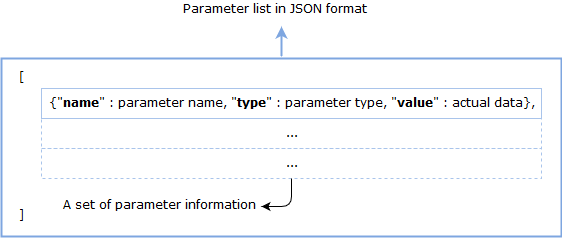

## Multi Signature Wallet SCORE
This document describes the inner workings of a Multi Signature Wallet SCORE and provides guidelines and APIs about how to use this service.

## Definition & Purpose

A Multi Signature Wallet is a SCORE that enables more than one user to manage their ICON funds safely. Such wallet can prevent one person from running off with the stored ICX or tokens and reduce the risk in case of one person is incapacitated or loses their keys. We adopted the multisig wallet mechanism inspired by [**gnosis**](https://github.com/gnosis/MultiSigWallet).

## How To Use
### Definition

#### Wallet
SCORE in which ICX and tokens are stored in. Stored ICX and tokens can be used (transferred) only when the wallet conditions declared internally are satisfied.

#### Wallet owner
Addresses who have participation rights of the Wallet SCORE. 

#### Transaction
Initiated by a wallet owner, a transaction changes the wallet state (e.g. transfer tokens or ICX stored in the wallet, add a new wallet owner, change requirements of confirmations (2 to 3 -> 3 to 3), etc).

#### Requirement
The number of approvals from the wallet owners required for the transaction to be executed.

### Logic

The first step is to deploy a multisig wallet SCORE. At the time of deployment, you can set wallet owners and a requirement value. For example, if you want to use a wallet which sets three wallet owners and needs two confirmations for executing a transaction (2 to 3), you have to input two parameters : 1) fill the `_walletOwners` field with three wallet addresses in a comma-separated string, 2) fill the `_required` field with '2' when deploying the wallet.

```json
{
    "_walletOwners": "hx7f39710d3718e7d1f307d7c71755fbbe76be3c71,hx07a2731037cfe59dbf76579d8ba1fbfc02616135,hxed36008ce6be8c8deb9acdfc05d1a06f5576a2db",
    "_required": "2"
}
```

After deploying the wallet, wallet owners can deposit ICX and tokens to this wallet as usual and manage it. 

If you want to use funds (e.g. send ICX or token) or change the internally set conditions (e.g. add owner, remove owner, change requirements), use the `submitTransaction` method. For example, if you want to send 10 ICX to a specific address, call `submitTransaction` with below parameters.

```json
{
    "_destination": "hx7f39710d3718e7d1f307d7c71755fbbe76be3c71",
    "_method": "",
    "_params": "",
    "_description": "send 10 icx to owner1",
    "_value": "0x8ac7230489e80000"
}
```
After the transaction is registered, other wallet owners can confirm this transaction using the `confirmTransaction` method, and only if the number of confirmations meets the 'requirement' value then this transaction is executed. All transactions' information are saved in the wallet eternally.

## Specification

### Methods (Read-only)

Below is the list of read-only methods. By calling these methods, you can get information from the wallet.

#### getRequirement

Returns the requirements value.

```python
@external(readonly=True)
def getRequirement(self) -> int:
```

**Example**

```json
{
    "jsonrpc": "2.0",
    "method": "icx_call",
    "id": 1,
    "params": {
        "from": "hx5dd0b2a161bc16194d38b050744c7cd623626661",
        "to": "cx30d7fcf580135d9f9eb491292555a5b29d9314cb",
        "dataType": "call",
        "data": {           
            "method": "getRequirement",
            "params": {}
        }
    }
}
```

**Call result**

```json
{
    "jsonrpc": "2.0",
    "result": "0x2",
    "id": 1
}
```

#### getTransactionInfo

Returns the transaction data for each ID.

```python
@external(readonly=True)
def getTransactionInfo(self, _transactionId: int) -> dict:
```

**Example**

```json
{
    "jsonrpc": "2.0",
    "method": "icx_call",
    "id": 1,
    "params": {
        "from": "hx5dd0b2a161bc16194d38b050744c7cd623626661",
        "to": "cx30d7fcf580135d9f9eb491292555a5b29d9314cb",
        "dataType": "call",
        "data": {           
            "method": "getTransactionInfo",
            "params": {
                "_transactionId": "0x00"
            }
        }
    }
}
```

**Call result**

```json
{
    "jsonrpc": "2.0",
    "result": {
        "_executed": "0x1",
        "_destination": "cx30d7fcf580135d9f9eb491292555a5b29d9314cb",
        "_value": "0x0",
        "_method": "addWalletOwner",
        "_params": "[{\"name\":\"_walletOwner\",\"type\":\"Address\",\"value\":\"hx1262526a4da004550021b5f9d249b9c7d98b5892\"}]",
        "_description": "add owner4 in wallet",
        "_transaction_id": "0x0"
    },
    "id": 1
}
```

#### getTransactionsExecuted

Returns a boolean which shows whether the transaction is executed or not.

```python
@external(readonly=True)
def getTransactionsExecuted(self, _transactionId: int) -> bool:
```

**Example**

```json
{
    "jsonrpc": "2.0",
    "method": "icx_call",
    "id": 1,
    "params": {
        "from": "hx5dd0b2a161bc16194d38b050744c7cd623626661",
        "to": "cx30d7fcf580135d9f9eb491292555a5b29d9314cb",
        "dataType": "call",
        "data": {           
            "method": "getTransactionsExecuted",
            "params": {
                "_transactionId": "0x00"
            }
        }
    }
}
```

**Call result**

```json
{
    "jsonrpc": "2.0",
    "result": "0x1",
    "id": 1
}
```

####  checkIfWalletOwner

Returns a boolean which shows whether a given address is a wallet owner or not.

```python
@external(readonly=True)
def checkIfWalletOwner(self, _walletOwner: Address) -> bool:
```

**Example**

```json
{
    "jsonrpc": "2.0",
    "method": "icx_call",
    "id": 1,
    "params": {
        "from": "hx5dd0b2a161bc16194d38b050744c7cd623626661",
        "to": "cx30d7fcf580135d9f9eb491292555a5b29d9314cb",
        "dataType": "call",
        "data": {           
            "method": "checkIfWalletOwner",
            "params": {
                "_walletOwner": "hx07a2731037cfe59dbf76579d8ba1fbfc02616135"
            }
        }
    }
}
```

**Call result**

```json
{
    "jsonrpc": "2.0",
    "result": "0x0",
    "id": 1
}
```

#### getWalletOwnerCount

Returns the total number of wallet owner.

```python
@external(readonly=True)
def getWalletOwnerCount(self) -> int:
```

**Example**

```json
{
    "jsonrpc": "2.0",
    "method": "icx_call",
    "id": 1,
    "params": {
        "from": "hx5dd0b2a161bc16194d38b050744c7cd623626661",
        "to": "cx30d7fcf580135d9f9eb491292555a5b29d9314cb",
        "dataType": "call",
        "data": {           
            "method": "getWalletOwnerCount",
            "params": {}
        }
    }
}
```

**Call result**

```json
{
    "jsonrpc": "2.0",
    "result": "0x3",
    "id": 1
}
```

#### getWalletOwners

Returns a list of wallet owners.

```python
@external(readonly=True)
def getWalletOwners(self, _offset: int, _count: int) -> list:
```

**Example**

```json
{
    "jsonrpc": "2.0",
    "method": "icx_call",
    "id": 1,
    "params": {
        "from": "hx5dd0b2a161bc16194d38b050744c7cd623626661",
        "to": "cx30d7fcf580135d9f9eb491292555a5b29d9314cb",
        "dataType": "call",
        "data": {           
            "method": "getWalletOwners",
            "params": {
                "_offset": "0x00",
                "_count": "0x0A"
            }
        }
    }
}
```

**Call result**

```json
{
    "jsonrpc": "2.0",
    "result": [
      "hx5dd0b2a161bc16194d38b050744c7cd623626661",
      "hxd980b07d43d1df399392f8871d6ec7c975f3e832",
      "hx4873b94352c8c1f3b2f09aaeccea31ce9e90bd31",
      "hx1262526a4da004550021b5f9d249b9c7d98b5892"
    ],
    "id": 1
}
```

#### getConfirmationCount

Returns a transaction confirmation count given a transaction ID.

```python
@external(readonly=True)
def getConfirmationCount(self, _transactionId: int) -> int:
```

**Example**

```json
{
    "jsonrpc": "2.0",
    "method": "icx_call",
    "id": 1,
    "params": {
        "from": "hx5dd0b2a161bc16194d38b050744c7cd623626661",
        "to": "cx30d7fcf580135d9f9eb491292555a5b29d9314cb",
        "dataType": "call",
        "data": {           
            "method": "getConfirmationCount",
            "params": {
                "_transactionId": "0x00"
            }
        }
    }
}
```

**Call result**

```json
{
    "jsonrpc": "2.0",
    "result": "0x2",
    "id": 1
}
```

#### getConfirmations

Returns a list of wallet owners who have been confirmed by a given transaction.

```python
@external(readonly=True)
def getConfirmations(self, _offset: int, _count: int, _transactionId: int) -> list:
```
**Example**

```json
{
    "jsonrpc": "2.0",
    "method": "icx_call",
    "id": 1,
    "params": {
        "from": "hx5dd0b2a161bc16194d38b050744c7cd623626661",
        "to": "cx30d7fcf580135d9f9eb491292555a5b29d9314cb",
        "dataType": "call",
        "data": {           
            "method": "getConfirmations",
            "params": {
                "_offset": "0x00",
                "_count": "0x0A",
                "_transactionId": "0x00"
            }
        }
    }
}
```

**Call result**

```json
{
    "jsonrpc": "2.0",
    "result": [
      "hx5dd0b2a161bc16194d38b050744c7cd623626661",
      "hxd980b07d43d1df399392f8871d6ec7c975f3e832"
    ],
    "id": 1
}
```

#### getTransactionCount

Returns the total number of transactions which is submitted in the wallet.

```python
@external(readonly=True)
def getTransactionCount(self, _pending: bool=True, _executed: bool=True) -> int:
```
**Example**

```json
{
    "jsonrpc": "2.0",
    "method": "icx_call",
    "id": 1,
    "params": {
        "from": "hx5dd0b2a161bc16194d38b050744c7cd623626661",
        "to": "cx30d7fcf580135d9f9eb491292555a5b29d9314cb",
        "dataType": "call",
        "data": {           
            "method": "getTransactionCount",
            "params": {
                "_pending": "0x00",
                "_executed": "0x01"
            }
        }
    }
}
```

**Call result**

```json
{
    "jsonrpc": "2.0",
    "result": "0x1",
    "id": 1
}
```

#### getTransactionList

Returns a list of transactions.

```python
@external(readonly=True)
def getTransactionList(self, _offset: int, _count: int, _pending: bool=True, _executed: bool=True) -> list:
```

**Example**

```json
{
    "jsonrpc": "2.0",
    "method": "icx_call",
    "id": 1,
    "params": {
        "from": "hx5dd0b2a161bc16194d38b050744c7cd623626661",
        "to": "cx30d7fcf580135d9f9eb491292555a5b29d9314cb",
        "dataType": "call",
        "data": {           
            "method": "getTransactionList",
            "params": {
                "_offset": "0x00",
                "_count": "0x0A",
                "_pending": "0x01",
                "_executed": "0x01"
            }
        }
    }
}
```

**Call result**

```json
{
    "jsonrpc": "2.0",
    "result": [
        {
            "_executed": "0x1",
            "_destination": "cx30d7fcf580135d9f9eb491292555a5b29d9314cb",
            "_value": "0x0",
            "_method": "addWalletOwner",
            "_params": "[{\"name\":\"_walletOwner\",\"type\":\"Address\",\"value\":\"hx1262526a4da004550021b5f9d249b9c7d98b5892\"}]",
            "_description": "add owner4 in wallet",
            "_transaction_id": "0x0"
        },
        {
            "_executed": "0x0",
            "_destination": "cx30d7fcf580135d9f9eb491292555a5b29d9314cb",
            "_value": "0x0",
            "_method": "addWalletOwner",
            "_params": "[{\"name\":\"_walletOwner\",\"type\":\"Address\",\"value\":\"hxbedeeadea922dc7f196e22eaa763fb01aab0b64c\"}]",
            "_description": "add owner5 in wallet",
            "_transaction_id": "0x1"
        }
    ],
    "id": 1
}
```

### Methods

Below is a list of the methods that the wallet owners can call.  

#### submitTransaction

Submit a transaction which is to be executed when the number of confirmations meets the 'requirement' value. Only wallet owners can call this method. The wallet owner who has called this method is confirmed as soon as the transaction is submitted successfully. 

```python
@external
def submitTransaction(self, _destination: Address, _method: str="", _params: str="", _value: int=0, _description: str=""):
```

`_destination` is the SCORE address in which `_method` is defined in. 

`_description` is a detailed description of the transaction (default value is ""). 

`_value` is amount of ICX coin in loop(1 icx = 1e18 loop) unit (default value is 0). 

`_method` is the name of the method that is to be executed when the number of confirmations meets the 'requrement' value.

`_params` is a stringified JSON data. This data is used as the arguments of the method `_method` when it is executed. Below is the format. **name** is parameter's name, **type** is parameter's type (supported types are `int`, `str`, `bool`, `Address`, `bytes`), **value** is the actual argument value. 




Below is an example of a `replaceWalletOwner` method call. After writing the request in the JSON format, you have to stringify it.
```json
[
    {"name": "_walletOwner","type": "Address","value":"hxef73db~"},
    {"name": "_newWalletOwner","type": "Address","value": "hxed360~"}
]
```
**Example**

```json
{
  "jsonrpc": "2.0",
  "method": "icx_sendTransaction",
  "params": {
    "version": "0x3",
    "from": "hx5dd0b2a161bc16194d38b050744c7cd623626661",
    "value": "0x0",
    "stepLimit": "0x3000000",
    "nid": "0x3",
    "nonce": "0x1",
    "to": "cx30d7fcf580135d9f9eb491292555a5b29d9314cb",
    "dataType": "call",
    "data": {
      "method": "submitTransaction",
      "params": {
        "_destination": "cx30d7fcf580135d9f9eb491292555a5b29d9314cb",
        "_method":"addWalletOwner",
        "_params":"[{\"name\":\"_walletOwner\",\"type\":\"Address\",\"value\":\"hx1262526a4da004550021b5f9d249b9c7d98b5892\"}]",
        "_description": "add owner4 in wallet"
      }
    }
  },
  "id": 1
}
```

**Sendtx result**

```json
{
    "jsonrpc": "2.0",
    "result": {
        "txHash": "0xca72bef2d0f3e77a6621dc20bf9f47d34e87f30b4f4717be9edfa2e2f15d24fa",
        "blockHeight": "0x4",
        "blockHash": "0xfc3ec6b4777b108f2c7fad4ee703a7f712d68b654a9ccb042ffc8614795f09a8",
        "txIndex": "0x0",
        "to": "cx30d7fcf580135d9f9eb491292555a5b29d9314cb",
        "stepUsed": "0x10bad0",
        "stepPrice": "0x0",
        "cumulativeStepUsed": "0x10bad0",
        "eventLogs": [
            {
                "scoreAddress": "cx30d7fcf580135d9f9eb491292555a5b29d9314cb",
                "indexed": [
                    "Submission(int)",
                    "0x0"
                ],
                "data": []
            },
            {
                "scoreAddress": "cx30d7fcf580135d9f9eb491292555a5b29d9314cb",
                "indexed": [
                    "Confirmation(Address,int)",
                    "hx5dd0b2a161bc16194d38b050744c7cd623626661",
                    "0x0"
                ],
                "data": []
            }
        ],
        "logsBloom": "0x000000000000000000000000000000000000000000000000000000000000000000000000000000000000000000000000000000000000000000010000000000000000000000000000000000000000000000000060000000000011000000000000000000000000000000000000000000000000000a0000000000800000000000000000000000000000000000000000000000000000000000000000000000000000000000000000000000000000000000000000002800000000004000000000000000000000000000000000000000000000000000100000000003200000000000000000000000000000000000000000000000000000000000000000000000000000",
        "status": "0x1"
    },
    "id": 1
}
```

#### confirmTransaction

Confirm a transaction corresponding to a ```_transactionId```. As soon as a transaction confirmation count meets the 'requirement' value, the transaction is executed. Only wallet owners can call this method.

```python
@external
def confirmTransaction(self, _transactionId: int):
```

**Example**

```json
{
  "jsonrpc": "2.0",
  "method": "icx_sendTransaction",
  "params": {
    "version": "0x3",
    "from": "hxd980b07d43d1df399392f8871d6ec7c975f3e832",
    "value": "0x0",
    "stepLimit": "0x30000000",
    "nid": "0x3",
    "nonce": "0x1",
    "to": "cx30d7fcf580135d9f9eb491292555a5b29d9314cb",
    "dataType": "call",
    "data": {
      "method": "confirmTransaction",
      "params": {
        "_transactionId": "0x00"
      }
    }
  },
  "id": 1
}
```

**Sendtx result**

```json
{
    "jsonrpc": "2.0",
    "result": {
        "txHash": "0x07f407914ae8a37183d588d75e9a9cfead3ce2ebc29af4c809e0cff493e7baaa",
        "blockHeight": "0x5",
        "blockHash": "0x4d28315fd2de5095ef6a8da3f39644be126ae29fef7ee89be52837acf50c4be6",
        "txIndex": "0x0",
        "to": "cx30d7fcf580135d9f9eb491292555a5b29d9314cb",
        "stepUsed": "0x1026c4",
        "stepPrice": "0x0",
        "cumulativeStepUsed": "0x1026c4",
        "eventLogs": [
            {
                "scoreAddress": "cx30d7fcf580135d9f9eb491292555a5b29d9314cb",
                "indexed": [
                    "Confirmation(Address,int)",
                    "hxd980b07d43d1df399392f8871d6ec7c975f3e832",
                    "0x0"
                ],
                "data": []
            },
            {
                "scoreAddress": "cx30d7fcf580135d9f9eb491292555a5b29d9314cb",
                "indexed": [
                    "WalletOwnerAddition(Address)",
                    "hx1262526a4da004550021b5f9d249b9c7d98b5892"
                ],
                "data": []
            },
            {
                "scoreAddress": "cx30d7fcf580135d9f9eb491292555a5b29d9314cb",
                "indexed": [
                    "Execution(int)",
                    "0x0"
                ],
                "data": []
            }
        ],
        "logsBloom": "0x00000000000000000000000000000000000000000000000001800000000000000000000000000000000000000000000000000000000000000000000000000000000000000000000000000000000000000000003000000000011000000000000000000000000000000000000000000000000000080000000000820000000000000000000000000000000000000000000000000002000000000221000000000000000000000000000000000000000000000000002800000000004000000000000000000000000000000000000000000000000000100000000002000000000000000000000000000000000000000000000000000040000000000020000000000000",
        "status": "0x1"
    },
    "id": 1
}
```

#### revokeTransaction

Revoke confirmation of a transaction corresponding to a ```_transactionId```. Only already confirmed wallet owners can revoke their own confirmation of a transaction. Wallet owners can't revoke others' confirmation.

```python
@external
def revokeTransaction(self, _transactionId: int):
```

**Example**

```json
{
  "jsonrpc": "2.0",
  "method": "icx_sendTransaction",
  "params": {
    "version": "0x3",
    "from": "hxef73db5d0ad02eb1fadb37d0041be96bfa56d4e6",
    "value": "0x0",
    "stepLimit": "0x3000000",
    "timestamp": "0x573117f1d6568",
    "nid": "0x3",
    "nonce": "0x1",
    "to": "cx4d5a79f329adcf00a3daa99539f0eeea2d43d239",
    "dataType": "call",
    "data": {
      "method": "revokeTransaction",
      "params": {
        "_transactionId": "0x01"
      }
    }
  },
  "id": 1
}
```

**Sendtx result**

```json
{
    "jsonrpc": "2.0",
    "result": {
        "txHash": "0x70a5c03cd41d205b5b93abf57e53160d3f58679b1f3c254a10db9d220ecfac21",
        "blockHeight": "0x7",
        "blockHash": "0x92558d91cc52f0ff75686d8b5691bf5cdcbd586eff625b9c93750b510d324887",
        "txIndex": "0x0",
        "to": "cx30d7fcf580135d9f9eb491292555a5b29d9314cb",
        "stepUsed": "0xf9c4a",
        "stepPrice": "0x0",
        "cumulativeStepUsed": "0xf9c4a",
        "eventLogs": [
            {
                "scoreAddress": "cx30d7fcf580135d9f9eb491292555a5b29d9314cb",
                "indexed": [
                    "Revocation(Address,int)",
                    "hx5dd0b2a161bc16194d38b050744c7cd623626661",
                    "0x1"
                ],
                "data": []
            }
        ],
        "logsBloom": "0x00000000000000000000000000000000000000000000000000000000000000000000000000000000000000000000000000000000000000000000000000000000000000000000000000000000000000000000004000000000000000000000000000000000000000000000000000000000000000400000000000040000000000000000000000000000000000000000000000000000000000000000000000000000000000000000000000000000000000000000000000000000002000000000000000000000000000000000000000000000000000020000000001300000000000000000000000000000000000000000000000000000000000000001000000000000",
        "status": "0x1"
    },
    "id": 1
}

```


### Methods (only called by wallet)

These methods only can be called by the multisig wallet SCORE itself. **In short, you can not call those methods directly (or it will fail)**. If you want to execute these methods, call ```submitTransaction``` and input method's information as a parameter. 

#### addWalletOwner

Adds a new wallet owner.

```python
@external
def addWalletOwner(self, _walletOwner: Address):
```
#### replaceWalletOwner

Replaces an existing wallet owner by a new wallet owner.

```python
@external
def replaceWalletOwner(self, _walletOwner: Address, _newWalletOwner: Address):
```
#### removeWalletOwner

Removes an existing wallet owner.

```python
@external
def removeWalletOwner(self, _walletOwner: Address):
```
#### changeRequirement

Change the requirement value. ```_required``` can't exceed the number of wallet owners. 

```python
@external
def changeRequirement(self, _required: int):
```


### Eventlogs

#### Confirmation

Must trigger on any successful confirmation.

```python
@eventlog(indexed=2)
def Confirmation(self, _sender: Address, _transactionId: int):
        pass
```
#### Revocation

Must trigger on any revoked confirmation.

```python
@eventlog(indexed=2)
def Revocation(self, _sender: Address, _transactionId: int):
        pass
```
#### Submission

Must trigger on any submitted transaction.

```python
@eventlog(indexed=1)
def Submission(self, _transactionId: int):
        pass
```
#### Execution

Must trigger on the transaction being executed successfully.

```python
@eventlog(indexed=1)
def Execution(self, _transactionId: int):
        pass
```
#### ExecutionFailure

Must trigger on a failure during the transaction execution.

```python
@eventlog(indexed=1)
def ExecutionFailure(self, _transactionId: int):
        pass
```
#### Deposit

Must trigger on a ICX deposit event to a MultiSig Wallet SCORE.

```python
@eventlog(indexed=1)
def Deposit(self, _sender: Address, _value: int):
        pass
```
#### DepositToken

Must trigger on a token deposit event to a MultiSig Wallet SCORE.

```python
@eventlog(indexed=1)
def DepositToken(self, _sender: Address, _value: int, _data: bytes):
        pass
```
#### WalletOwnerAddition

Must trigger on adding a new wallet owner.

```python
@eventlog(indexed=1)
def WalletOwnerAddition(self, _walletOwner: Address):
        pass
```
#### WalletOwnerRemoval

Must trigger on removing a wallet owner.

```python
@eventlog(indexed=1)
def WalletOwnerRemoval(self, _walletOwner: Address):
        pass
```
#### Requirement

Must trigger on changing the requirement value.

```python
@eventlog
def RequirementChange(self, _required: int):
        pass
```

## Implementation
* will be updated

## References
* [https://github.com/gnosis/MultiSigWallet](https://github.com/gnosis/MultiSigWallet)
